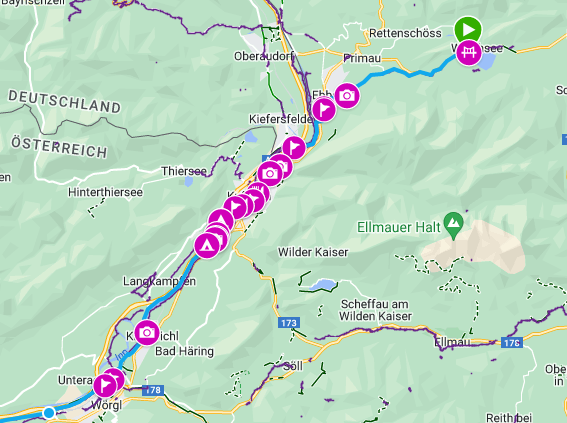

# Waypoint generator for Garmin outdoor navigation

## About
This tool automatically adds points of interests to your planned GPS-Route instead of manually adding them using Garmin Connect. They will be viewed on modern Garmin navgigation devices. POIs are queried using the pubic Overpass-Turbo API.

## Required software
NPM and Node

## Workflow
1. Clone the repository and run *npm install*
2. Download your planned route as GPX-File from any source (Komoot, Strava, Garmin etc.)
3. Optional: Modify the config.json file to match your points of interest.
4. Run the *autowaypoint.js" script. See below for the usage.
5. Import the generated new GPX-File to Garmin Connect

## Parameters

node autowaypoint.js <Input.gpx> <Config.json> <Output.gpx> <...optional paramaters>

### Optional parmeters

- *use_cache*: After running the script once, the data for the last route is cached. If you just modify the filters (like distance and markers) you can add the use_cache parameter to skips querying the POIs whichs makes the script much faster.
